## Introduction
`python-linbus` abstracts LIN (Local Interconnect Network) data link layers through a unified interface, inspired by `python-can`'s approach. This high-level API simplifies LIN master/slave development by handling protocol complexities, enabling rapid integration of LIN devices for automotive, industrial automation, and embedded systems applications.

***Key** **advantages**:*

- Hardware-agnostic communication layer
- Accelerated prototyping/testing cycles
- Cross-domain LIN system development

## Features

### 📡 Protocol Compliance

**Core Standards Implementation**:

- **ISO 17987-4:2016** - Electrical physical layer (EPL) specification 12 V
- **ISO 17987-3:2016** - Protocol specification

### 🚀 Physical Layer -> Multi-Device Support

- **Extensible Adapter Architecture**: Support various LIN hardware interfaces including:
  - Vector LIN interfaces (e.g., VN1610/VN1611)
  - PCAN-LIN interfaces
  - Kvaser LIN interfaces
  - Custom hardware via plugin system
- **Hardware Abstraction Layer**: Unified API for LIN frame transmission/reception across different devices

### ⚙️ DataLink Layer -> LIN Protocol Stack

- **Master Node Implementation**:
  - LIN frame scheduling with configurable timing
  - Schedule table management
  - Diagnostic frame handling (LIN 2.0+)
- **Slave Node Simulation**:
  - Frame response configuration
  - Event-driven frame handling
  - Error injection capabilities

- **LDF Parser**: Full support for LIN Description File (LDF) v2.1+ specifications

**NOTE**：Due to device resource limitations, priority is currently given to Vector VN 1640

## Getting Started

TBD

## Contributing

🚧 **Project Status**: This project is currently in its early development phase. We highly value community input and welcome discussions about:
- Architecture design decisions
- Hardware compatibility requirements
- Protocol implementation details
- Feature prioritization

**Development Milestones**:

- Q2 2025: Basic physical layer implementation

- Q4 2025: Full Data layer services

    